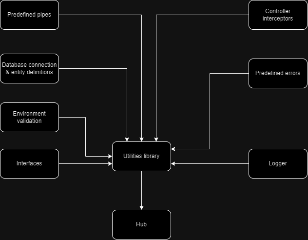

# NestJS Microservices Showcase

## Summary
1. [Introduction](#introduction)
2. [Requirements](#requirements)

---
## Introduction
#### This repo contains examples of such microservices connection types as:

* Kafka - [ ]
* RabbitMQ - [ ]

---
## Running projects

### **Docker** appoach

The repo can be run either natively or via `Docker`. If you would like to run it via `Docker` there are the next commands that might be useful:

* #### Compose and run

```bash
docker-compose up -d --build
```

* #### Stop the containers

```bash
docker-compose down
```

#### Optional parameters

| Name | Reason |
|:-|:-|
| `-rmi all` | remove created containers<br/> instead of just stopping them
| `-v` | remove attached volumes<br/> to Docker cache and volume<br/>  bindings

---

### Native approach

All of the contained projects are build with the next dependencies:

* Node version - **20 LTS**
* Package manager - **NPM ver. ^10.4.0**

> Every project contains its own description of how to run it

---
## Services graph

Each service has its own purpose. Services expanations are down below

### Services description table

| Name | Description |
| :-: | - |
| [Hub]() | Main service that contains general controllers`<br/> definitions
| [Lib]() | Helper poject that contains general definitions<br/>that are used in almost every other project

### Services dependency graph

